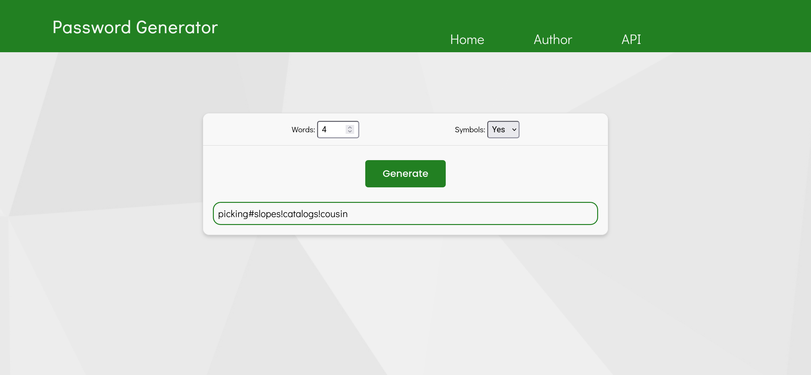

# Password-gen-website
This is a website interface for a password-generating tool. This generator is meant for creating passwords that can be remembered or at least easily typed, while being very secure. 

Most generators produce passwords that are long strings of random characters and symbols. These types of passwords are unguessable and very resistant to cracking. However, it is also unlikely for a person to remember even a couple of these types of passwords that are more than 8 characters long. Password managers can somewhat eliminate this problem, but they are not always easily available. My generator produces passwords that are much easier to remember and type while also being very secure. It works by stringing together least used English words joined by spaces or special characters. This method can produce long but memorable passwords, which are also unguessable and resistant to brute force or dictionary attacks.  

### Screenshot

